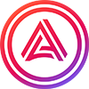
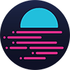
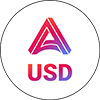
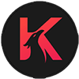

# __Awards And Acknowledgements__
 

## Table of Contents
1. [Moonbeam Connected Contracts Hackathon](#moonbeam-connected-contracts-hackathon) - :trophy: 1st
2. [Polkadot North America Hackathon](#polkadot-north-america-hackathon) - :trophy: 1st x 4
3. [Amsterdot Hackathon](#amsterdot-hackathon) - :trophy: 1st x 3
4. [Moonriver Grand Hackathon](#moonriver-grant-hackathon) - :trophy: 2nd
5. [ETH Denver Hackathon](#eth-denver-hackathon) - :trophy: 1st x 2
6. [Darwinia Hackathon](#darwinia-hackathon) - :trophy: 1st
7. [The Encode Polkadot Accelerator Program](#the-encode-polkadot-accelerator-program)
8. [The Encode Polkadot Hackathon](#the-encode-polkadot-hackathon) - :trophy: 1st
 
 

## Moonbeam Connected Contracts Hackathon
***

311 Participants / 41 Projects
 

The Moonbeam Connected Contracts Hackathon took place From August 15 to September 26th and was organised by  Moonbeam, Axelar, and Arrington Capital.
  
<h3 align="center">
:trophy: Improve The Governance UX Winner $7,500 - DemocraDot
</h3>
 
<i>

Participants were encouraged to build and submit projects in either of the following categories:
* Cross-chain dApps on the Moonbeam network
* Moonbeam Governance improvements 

We decided to submit a project that would try to improve the governance experience on Moonbeam.
We believe that in order to improve governance participation across any blockchain, the information flow and decision making has to move away from the desktop and onto the mobile.

Therefore for this project we decided to take the harder development route of building with a mobile only approach.

Our project showcased the ability to:

* Browse the latest proposals and referenda from a mobile device
* Vote and endorse on live referenda from a mobile device 
* Receive mobile PUSH notifications on various stages of the democratic process

Technologies used during the mobile project included:
* Metamask mobile integration for connectivity and signing vote submissions
* Subquery indexing on democracy data for displaying Propasal and Referenda information on the mobile device
</i>
 

Links To Awards And Acknowledgements: 

* <a href="https://twitter.com/MoonbeamNetwork/status/1580679623561863169" target="_blank">Moonbeam Winners Tweet</a>
 

## Polkadot North America Hackathon
***

1137 Participants
 

The Polkadot Hackathon Global Series North America Edition was the second in a series of global hackathons that brought the cutting edge of blockchain to the global community.

Focusing on Substrate, Polkadot, and Kusama, this hackathon was open to both individuals and teams anywhere in the world. As well as blockchain building, participants took advantage of mentoring hours and networking opportunities that were invaluable when starting new projects or building teams.
  
<h3 align="center">
:trophy: Overall Grand Prize Winner $30,000 - XCM DOT AUTOSTAKE
 
:trophy: Build An XCM Related Tool For Moonbeam $5000 - XCM DOT AUTOSTAKE
</h3>
 
<i>
We built this project to solve the current problem of a user having to manually manage their DOT asset holdings on multiple parachains if they wish to stake DOT for Liquid DOT in the Acala Ecosystem. The project achieves the following: 

* A simple UI walks the user through the process of autostaking DOT from any parachain onto Acala for LDOT.
* Unstaking LDOT Back to DOT is also facilitated.
* The UI also provides the user with the ability to transfer a wide selection of assets between Parachains and Relay Chains on the Polkadot Ecosystem. 
* The project makes extensive use of the Cross Consensus Messaging Format (XCM).

To showcase the project, the following assets and chains were included in the project:

</i>
 
 
<h3 align="center">
:trophy: Acala EVM+ DApp For aUSD Yield - $5,000 - ACALA LDOT YIELD MANAGER
</h3>
 
<i>
We built this project to allow the user to stake DOT for LDOT and then periodically take the accumulated LDOT yield and automatically swap it for other assets on the Acala platform, such as aUSD and/or ACA. 
This allows the user to create a regular Dollar Cost Average (DCA) investment strategy using the passive income from their staked LDOT. 
The project made extensive use of the following to allow the user to choose the desired reinvestment strategy for their LDOT yield: 

* Acala Scheduler
* Acala DEX
* Acala EVM 

We created a smart contract strategy that automates the monitoring and collecting of LDOT yield on a regular basis. 
Whilst the amount of Staked LDOT from the user remains the same at all times, the value of that LDOT (in DOT) slowly appreciates over time. By using the Acala Scheduler to run regular sweeps of the excess yield that has accumulated, we then swapped this excess DOT for another asset of the users choice using the Acala DEX before transferring it back to the user. 
</i>

Links To Awards And Acknowledgements: 

* <a href="https://www.youtube.com/watch?v=oD1Zg0PkXJg&t=950s" target="_blank">Award Presentation Video</a>
* <a href="https://twitter.com/Polkadot/status/1571484017681379331" target="_blank">Polkadot Tweet</a>
* <a href="https://twitter.com/MoonbeamNetwork/status/1555654398658977792" target="_blank">Moonbeam Tweet</a>
* <a href="To Be Completed" target="_blank">Award Image</a>
* <a href="https://ultcoin365.com/polkadots-north-america-hackathon-is-won-by-a-cross-chain-dot-staking-dapp/" target="_blank">Media Example 1</a> - <a href="https://en.blogtienao.com/xcm-dot-autostake-gianh-chien-thang-trong-cuoc-thi-hackathon-bac-my-cua-polkadot/" target="_blank">Media Example 2</a> - <a href="https://www.thecoinrepublic.com/2022/09/19/xcm-dot-autostake-winner-of-polkadot-hackathon-north-america/" target="_blank">Media Example 3</a> - <a href="https://thecoindesk.com/nhom-entity-54-gianh-chien-thang-tai-hackathon-cua-polkadot/" target="_blank">Media Example 4</a> - <a href="https://cryptoguidehub.com/xcm-dot-autostake-wins-polkadot-north-american-hackathon/" target="_blank">Media Example 5</a>
 

## Amsterdot Hackathon
***

351 Participants 
 

The AmsterDOT Hackathon was an 8-week long online event which kicked off on 20th April 2022 - the beginning of the AmsterDOT Conference, and lasted until 20th June 2022. 

The aim of the hackathon was to create a team-overarching effort which incentivizes contributions to the Polkadot ecosystem. For this purpose, 20 bounties were submitted by 8 ecosystem teams: HydraDX, Basilisk, Acala, Astar, Interlay, Phala, Subsquid and Moonbeam. 

The results of the voting for the prize pool were presented live at Polkadot Decoded in Berlin, and were furthermore published on the amsterDOT website.

 
<h3 align="center">
:trophy: Overall Grand Prize Winner $24,000 - MORPH FOR ACALA/BASILISK
 
:trophy: Acala Cross Chain DApp Bounty Winner $5,000 - MORPH FOR ACALA
 
:trophy: Cross Chain Transfer SDK $10k BSX + $10k HDX - MORPH FOR BASILISK
</h3>
 
<i>
We built the MORPH project to showcase how it is possible to transfer a wide selection of assets between Parachains and Relay Chains via the Cross Consensus Messaging Format (XCM).

In addition to XCM transfers the project also included the ability to:
* Autostake KSM onto Karura FROM ANY PARACHAIN with a few simple clicks.
* Unstake LKSM directly from within the DApp.

 
Further Information 
Two kinds of vertical message-passing transport protocols have been used in the project:

* Upward Message Passing (UMP): This allows parachains to send messages to their relay chain.

* Downward Message Passing (DMP): This allows the relay chain to pass messages down to one of its parachains.

In addition, the project used Horizontal Relay-routed Message Passing (HMRP): This allows the parachains to parachain messaging on the same relay chain.

To showcase the project, the following assets and chains were included in the project:

</i>
 
 
<h3 align="center">
:trophy: Overall Prize Winner $9,000 - ACALA LDOT YIELD MANAGER
 
:trophy: Acala EVM+ DApp For aUSD Yield - $5,000 - ACALA LDOT YIELD MANAGER
</h3>
 
<i>
We built the Yield Manager makes it easy to:

* Manage any AUSD staking yield automatically at pre-determined times.
* Autoswap AUSD yield for other assets, such as DOT and/or ACA.

This project makes extensive use of the Acala Scheduler to allow the user to choose the desired reinvestment strategy for their AUSD yield from existing liquidity pools.

We created multiple smart contracts for this project.

Firstly we needed to create a form of staking income so the user could stake their asset, for example DOT, and receive aUSD. They could then either keep the aUSD as income or they could swap the aUSD for ACA or another asset e.g. DOT or LDOT to establish an ongoing dollar cost average (DCA) strategy.

We created a staking smart contract whereby the staked DOT is paid a yield in aUSD.

In addition we created a smart contract strategy to automate the yield collection of aUSD on a regular basis using the Acala Scheduler and then swap it for ACA before transferring it back to the user. 
</i>

Links To Awards And Acknowledgements: 

* <a href="https://www.youtube.com/watch?v=4XTyJwTpsZk&t=724s" target="_blank">Award Presentation Video</a>
* <a href="https://amsterdot.io/hackathon-2022" target="_blank">Amsterdot Winners Website</a>
* <a href="https://twitter.com/amsterdot_conf/status/1542497358377803776" target="_blank">Amsterdot Tweet</a>
* <a href="https://twitter.com/AcalaNetwork/status/1551777082920898560" target="_blank">Acala Tweet</a>
* <a href="https://twitter.com/bsx_finance/status/1554027346914643968" target="_blank">Basilisk Tweet</a>
 

## Moonriver Grant Hackathon
***
 

The Moonriver Grant Hackathon took place from March 23th to May 20th and was open to all BUIDLers that were willing to build on Moonriver/Moonbase Alpha.
The hackathon was a learning opportunity and a chance to dive into the Moonriver ecosystem with resources like workshops and office hours. 
1/2 of all the hackathon rewards were distributed via Quadratic Funding (people's choice awards). 
  
<h3 align="center">
:trophy: XCM Cross Chain Explorer 2nd Prize $3,500 - XCMonitor 
:trophy: Huobi Incubator Best Overall 3rd Prize $4,000 - XCMonitor
</h3>
 
<i>

We built the XCM Explorer project to showcase how it is possible to analyse XCM transactions.

Extensive use of SubQuery indexing was used within the project to show all of the metadata information involved in the transfer path of an XCM transaction.
At the time of this hackathon, the XCM technology had only just been released and we were one of only a very small number of teams working on it within the Polkadot/Kusama ecosystem.

To showcase the project, the following assets and chains were included in the project:

</i>
 

Links To Awards And Acknowledgements: 

* <a href="https://moonbeam.network/blog/moonriver-grant-hackathon-winners/" target="_blank">2022 Moonriver Grant Hackathon Winners</a>
* <a href="https://twitter.com/MoonriverNW/status/1539337587852251136" target="_blank">Moonriver Tweet</a>
 

## ETH Denver Hackathon
***
 

ETHDenver is an annual ethereum-focused event dedicated to hacking and networking. 
The virtual hackathon took place during February 2022 with various bounty competitions organised by the whole blockchain industry.
  
<h3 align="center">
:trophy: Acala Deploy A DApp On Acala EVM+ $4,000 - Entity54 DMS  
:trophy: Moonbeam Build a DApp that uses XCM $3,750 - Entity54 ETH Denver MB
</h3>
 
<i>
Both projects submitted to this hackathon tried to showcase new blockchain technologies including: 

* The Acala Scheduler.
* Cross Chain Messaging (XCM).
</i>

Links To Awards And Acknowledgements: 

* <a href="https://www.ethdenver.com/eden2022-virtual-winners" target="_blank">ETH Denver Virtual Winners</a>
 

## Darwinia Hackathon
***

 37 Submissions
 

The Darwinia Crab Hackathon took place bewteen 5th January-3rd March 2022 and aimed to encourage developers to contribute ideas and early-stage projects related to Web3 Tools, DeFi, Metaverse, and NFT to the Darwinia Crab ecosystem. DVM(Darwinia Virtual Machine) is EVM(Ethereum Virtual Machine) compatible, which provides developers with the ability to rapidly port dapps from Ethereum and EVM-compatible chains to the Polkadot ecosystem. 

Along with an EVM platform, Crab also provides a Substrate-to-Substrate bridge and Ethereum cross-chain bridge.  
 
<h3 align="center">
:trophy: Web3 Tools Track Merit Prize $8,000 - Token Buidl Ecosystem 
</h3>

 
<i>
For this project we built 3 smart contracts to perform the funtion of an ORACLE, a MINTER and a DEX and deployed them to the Pangolin network.  
We also built both back end and front end interfaces to showcase the integration of the whole system, along with two explanatory demo videos.
</i>
 

Links To Awards And Acknowledgements: 

* <a href="https://medium.com/darwinianetwork/meet-crab-online-hackathon-winners-9e35cb6fff78" target="_blank">Darwinia Crab Hackathon Winners Announcement</a>
 

## The Encode Polkadot Accelerator Program
***

December 2021 - February 2022
 

The Polkadot Accelerator Program was a 10-week, online accelerator taking the best hackathon and early-stage projects worldwide and helping them take the leap to become fully-fledged startups.
  

The structure of the Accelerator included the following:

* Weekly workshops to discuss project building
* Dedicated 1-1 mentorship meetings
* $4k Stipend per team
* The program ended with a pitch day for follow on funding and grants

Workshop Topics Included:

* Rapid Prototyping
* Lean Startup Methods
* Product Market Fit
* Marketing
* Meetings With Investors / Entrepreneurs
 

<i>
During the Accelerator Program we built a project called Calibrate. 
This was a DEFI DApp that offered a simple way for new users to invest in a basket of cryptocurrencies.

The DApp made it simple for a user to just deposit only stable assets and choose an area of Crypto that they were interested in from a range of groups we had setup using smart contracts.

We would then automatically batch swap the stable assets into the correct weightings for the group (vault) they had chosen via the Acala DEX.

Periodically the vaults would rebalance to make sure that the weighting of the holdings were at the correct values according to either market cap or volatility.
Highlights included:

* Individual smart contract vaults for DEFI, Gaming, Layer 1s, Oracles, Top 20 assets, Ecosystems etc
* Automatic rebalancing of vaults according to market market cap or volatility

</i>

Links To Awards And Acknowledgements: 

* <a href="https://medium.com/encode-club/polkadot-accelerator-summary-3f35a7023dd2" target="_blank">Polkadot Accelerator Summary</a>
 

## The Encode Polkadot Hackathon
***

 9th September 2021 - 31st October 2021
 

This Endoe hackathon was part of a long-term Polkadot educational programme, funded by the Polkadot on-chain treasury.

The purpose of the hackathon was to educate, support and catalyse the emergence of new talent into the blockchain space. Encode works across 100+ universities worldwide, running hackathons, accelerators, education series as well as investing and recruiting the best candidates to join leading blockchain companies.
  
<h3 align="center">
:trophy: Acala Build A DeFi DApp Category Winner $3,500 - T54 
:trophy: Best DApp Category 3rd Place $1,000 - T54
</h3>
 
<i>

We built the T54 DApp to showcase the various facilities available on the Acala parachain.

The DApp enabled the user to carry out a number of activities including:

* Reading and displaying account balance information
* Asset swap facilities using the integrated Acala DEX
* Initialising new loans and transfer loans to other users
* Setting portfolio investment goals and targets on real world assets

</i>
Our work on this project was recognised we were offered to enroll for the Encode Polkadot Accelerator Program.

 

Links To Awards And Acknowledgements: 

* <a href="https://medium.com/encode-club/polkadot-hack-finale-prizewinners-and-summary-931627c64d9" target="_blank">Encode Polkadot Hack Finale Prizewinners And Summmary</a>

 